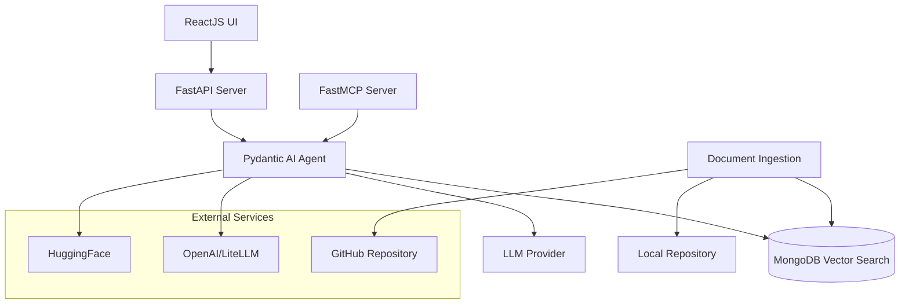

# Design Document

## Overview

The Generic Suite CodeGen is a comprehensive Retrieval-Augmented Generation (RAG) AI system that combines document ingestion, vector search, AI agent capabilities, and a user-friendly interface. The system enables developers to query GenericSuite documentation, generate JSON configuration files, create Python Langchain/MCP Tools, and scaffold frontend/backend application code following GenericSuite patterns.

The architecture follows a modular microservices approach with clear separation of concerns between document processing, AI agent functionality, API services, and user interface components.

## Architecture

### High-Level Architecture



### Component Architecture

The system is organized into distinct layers:

1. **Presentation Layer**: ReactJS UI with ShadCn components
2. **API Layer**: FastAPI endpoints and FastMCP server
3. **Business Logic Layer**: Pydantic AI agent with tools
4. **Data Processing Layer**: Document ingestion and embedding generation
5. **Data Storage Layer**: MongoDB Vector Search database

## Components and Interfaces

### 1. Document Ingestion Pipeline

**Location**: `server/genericsuite_codegen/document_processing/`

**Components**:
- `ingestion.py`: Main orchestrator for document processing workflow
- `processors.py`: File format processors (TXT, PDF, code files)
- `chunker.py`: Text chunking with configurable strategies
- `embeddings.py`: Embedding generation using OpenAI or HuggingFace

**Key Interfaces**:
```python
class DocumentProcessor:
    def process_repository(self, repo_url: str, local_dir: str) -> List[Document]
    def process_file(self, file_path: str) -> Document
    def chunk_document(self, document: Document) -> List[DocumentChunk]
    def generate_embeddings(self, chunks: List[DocumentChunk]) -> List[EmbeddedChunk]

class EmbeddingProvider:
    def generate_embedding(self, text: str) -> List[float]
    def get_embedding_dimension(self) -> int
```
### 2. MongoDB Vector Search Database

**Location**: `server/genericsuite_codegen/database/`

**Components**:
- `setup.py`: Database connection management and table creation
- Vector search operations with similarity scoring
- Document metadata storage and retrieval

**Key Interfaces**:
```python
class VectorDatabase:
    def store_embeddings(self, embedded_chunks: List[EmbeddedChunk]) -> bool
    def search_similar(self, query_embedding: List[float], limit: int) -> List[SearchResult]
    def delete_all_vectors(self) -> bool
    def get_document_count(self) -> int

class SearchResult:
    content: str
    metadata: Dict[str, Any]
    similarity_score: float
```

### 3. Pydantic AI Agent

**Location**: `server/genericsuite_codegen/agent/`

**Components**:
- `agent.py`: Main agent definition with Pydantic AI framework
- `tools.py`: Knowledge base search and code generation tools
- `prompts.py`: System prompts and templates

**Key Interfaces**:
```python
class GenericSuiteAgent:
    def query_knowledge_base(self, query: str) -> str
    def generate_json_config(self, requirements: str) -> Dict[str, Any]
    def generate_langchain_tool(self, specification: str) -> str
    def generate_mcp_tool(self, specification: str) -> str
    def generate_frontend_code(self, requirements: str) -> Dict[str, str]
    def generate_backend_code(self, framework: str, requirements: str) -> Dict[str, str]

class KnowledgeBaseTool:
    def search(self, query: str, limit: int = 5) -> List[str]
```

### 4. FastAPI Server

**Location**: `server/genericsuite_codegen/api/`

**Components**:
- `main.py`: FastAPI application setup and configuration
- `endpoint_methods.py`: Core endpoint implementations
- `utilities.py`: Shared utility functions
- `types.py`: Pydantic models for request/response validation

**Key Endpoints**:
```python
POST /api/query - Query the AI agent
POST /api/update-knowledge-base - Refresh repository and embeddings
POST /api/upload-document - Upload additional context documents
GET /api/conversations - List user conversations
POST /api/conversations - Create new conversation
GET /api/health - Health check endpoint
```

### 5. ReactJS User Interface

**Location**: `ui/`

**Components**:
- Knowledge base management interface
- Document upload functionality
- AI agent chat interface with conversation history
- File download capabilities for generated code
- Real-time status updates during processing

**Key Features**:
- ShadCn component library integration
- Responsive design for desktop and mobile
- File drag-and-drop upload
- Syntax highlighting for generated code
- Export functionality for multiple file formats

### 6. FastMCP Server

**Location**: `mcp-server/`

**Components**:
- MCP protocol implementation
- Tool exposure for external integrations
- Resource management for agent capabilities

**Exposed Tools**:
- Knowledge base search
- Code generation tools
- Document processing utilities

## Data Models

### Core Data Structures

```python
@dataclass
class Document:
    id: str
    path: str
    content: str
    file_type: str
    metadata: Dict[str, Any]
    created_at: datetime

@dataclass
class DocumentChunk:
    id: str
    document_id: str
    content: str
    chunk_index: int
    metadata: Dict[str, Any]

@dataclass
class EmbeddedChunk:
    chunk: DocumentChunk
    embedding: List[float]
    embedding_model: str

@dataclass
class Conversation:
    id: str
    user_id: str
    title: str
    messages: List[Message]
    created_at: datetime
    updated_at: datetime

@dataclass
class Message:
    role: str  # 'user' or 'assistant'
    content: str
    timestamp: datetime
    sources: List[str] = None
```##
# Database Schema

**knowledge_base Collection**:
```json
{
  "_id": "ObjectId",
  "path": "string",
  "content": "string",
  "embedding": "array<float>",
  "file_type": "string",
  "chunk_index": "number",
  "metadata": "object",
  "created_at": "datetime"
}
```

**ai_chatbot_conversations Collection**:
```json
{
  "_id": "ObjectId",
  "user_id": "string",
  "title": "string",
  "messages": "array<object>",
  "creation_date": "datetime",
  "update_date": "datetime"
}
```

**users Collection**:
```json
{
  "_id": "ObjectId",
  "firstname": "string",
  "lastname": "string",
  "email": "string",
  "status": "number",
  "plan": "number",
  "superuser": "number",
  "birthday": "date",
  "gender": "number",
  "language": "number",
  "creation_date": "datetime",
  "update_date": "datetime",
  "passcode": "string"
}
```

## Error Handling

### Error Categories and Strategies

1. **Document Processing Errors**:
   - File access failures: Graceful skipping with logging
   - Parsing errors: Fallback to raw text extraction
   - Embedding generation failures: Retry with exponential backoff

2. **Database Errors**:
   - Connection failures: Automatic reconnection with circuit breaker
   - Query timeouts: Configurable timeout with fallback responses
   - Vector search errors: Fallback to text-based search

3. **AI Agent Errors**:
   - LLM API failures: Provider switching and retry logic
   - Context length exceeded: Automatic context truncation
   - Rate limiting: Exponential backoff and queue management

4. **API Errors**:
   - Request validation: Detailed error messages with field-level feedback
   - Authentication failures: Clear error codes and retry guidance
   - Server errors: Structured error responses with correlation IDs

### Error Response Format

```python
@dataclass
class ErrorResponse:
    error_code: str
    message: str
    details: Dict[str, Any] = None
    correlation_id: str = None
    timestamp: datetime = None
```

## Testing Strategy

### Unit Testing

- **Document Processing**: Test file parsing, chunking algorithms, and embedding generation
- **Database Operations**: Mock MongoDB operations and test query logic
- **AI Agent**: Mock LLM responses and test tool integration
- **API Endpoints**: Test request/response validation and error handling

### Integration Testing

- **End-to-End Workflows**: Test complete document ingestion to query response
- **Database Integration**: Test with real MongoDB instance
- **External API Integration**: Test with actual LLM providers (with rate limiting)

### Performance Testing

- **Vector Search Performance**: Benchmark query response times with various dataset sizes
- **Concurrent Request Handling**: Load testing for API endpoints
- **Memory Usage**: Monitor memory consumption during document processing

### Test Structure

```
tests/
├── unit/
│   ├── test_document_processing.py
│   ├── test_database.py
│   ├── test_agent.py
│   └── test_api.py
├── integration/
│   ├── test_ingestion_pipeline.py
│   ├── test_agent_workflow.py
│   └── test_api_integration.py
└── performance/
    ├── test_vector_search.py
    └── test_concurrent_requests.py
```## 
Security Considerations

### Authentication and Authorization

- API key-based authentication for MCP server
- User session management for web interface
- Role-based access control for administrative functions

### Data Protection

- Environment variable management for sensitive configuration
- Secure storage of API keys and database credentials
- Input sanitization for all user-provided content

### Network Security

- CORS configuration for cross-origin requests
- HTTPS enforcement in production
- Rate limiting to prevent abuse

## Performance Optimization

### Caching Strategy

- Vector search result caching for frequently asked questions
- Embedding caching to avoid regeneration
- API response caching for static content

### Database Optimization

- Vector index optimization for similarity search
- Connection pooling for database operations
- Query optimization for conversation retrieval

### Resource Management

- Asynchronous processing for document ingestion
- Memory-efficient chunking for large documents
- Background task queuing for heavy operations

## Deployment Architecture

### Container Strategy

- Multi-stage Docker builds for optimized images
- Separate containers for API server, UI, and database
- Health checks and restart policies for reliability

### Service Orchestration

- Docker Compose for local development
- Environment-specific configuration management
- Volume mounting for persistent data and development

### Monitoring and Logging

- Structured logging with correlation IDs
- Health check endpoints for service monitoring
- Performance metrics collection for optimization

## Technology Stack Integration

### AI and ML Components

- **Pydantic AI**: Primary framework for agent implementation with type safety
- **OpenAI API**: Primary LLM provider with GPT models
- **LiteLLM**: Multi-provider LLM integration for flexibility
- **HuggingFace Transformers**: Alternative embedding models and local inference
- **MongoDB Vector Search**: Native vector similarity search capabilities

### Backend Technologies

- **FastAPI**: Modern Python web framework with automatic API documentation
- **FastMCP**: MCP server implementation for tool integration
- **PyMongo**: MongoDB driver for Python with async support
- **Poetry**: Dependency management and packaging
- **PyPDF2**: PDF text extraction for document processing

### Frontend Technologies

- **ReactJS**: Component-based UI framework
- **Vite**: Fast build tool and development server
- **ShadCn/UI**: Modern component library with Tailwind CSS
- **TypeScript**: Type-safe JavaScript development

### Infrastructure

- **Docker**: Containerization for consistent deployment
- **Docker Compose**: Multi-container orchestration
- **Nginx**: Reverse proxy and static file serving
- **MongoDB**: Document database with vector search capabilities

## Configuration Management

### Environment Variables

The system uses comprehensive environment configuration for all components:

- **Application Settings**: Domain, name, debug modes
- **Database Configuration**: MongoDB connection strings and settings
- **AI Provider Settings**: API keys, model selection, and parameters
- **Server Configuration**: Ports, CORS settings, and security
- **UI Configuration**: Build settings and API endpoints

### Configuration Validation

- Environment variable validation at startup
- Default value fallbacks for optional settings
- Configuration schema documentation
- Runtime configuration updates for development

## Scalability Considerations

### Horizontal Scaling

- Stateless API design for load balancing
- Database connection pooling for concurrent requests
- Caching layers to reduce database load
- Asynchronous task processing for heavy operations

### Vertical Scaling

- Memory optimization for large document processing
- Efficient vector storage and retrieval
- Streaming responses for large generated content
- Resource monitoring and alerting

### Future Enhancements

- Multi-tenant architecture support
- Advanced caching strategies (Redis integration)
- Distributed task queuing (Celery integration)
- Advanced mo