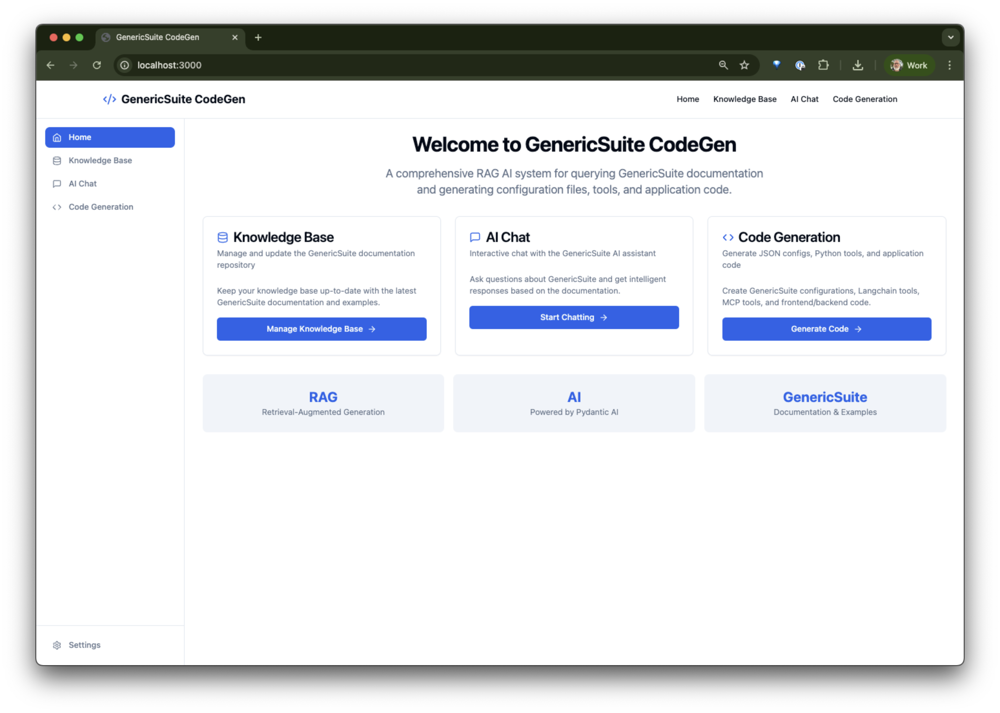

# Kiro SDLC Screenshots

This file contains the Kiro SDLC (Software Development Life Cycle) step-by-step process followed to develop the GenericSuite CodeGen project from scratch.

## Table of Contents

- [Starting Kiro chat with the initial prompt](#starting-kiro-chat-with-the-initial-prompt)
- [Refining the initial prompt and refreshing the requirements.md](#refining-the-initial-prompt-and-refreshing-the-requirementsmd)
- [Generating design.md and task.md](#generating-designmd-and-taskmd)
- [Starting task execution](#starting-task-execution)
- [Fixing issues with code generated in the task execution](#fixing-issues-with-code-generated-in-the-task-execution)
- [Create the deploy-dependency-sync spec](#create-the-deploy-dependency-sync-spec)
- [Fix MCP server running issues](#fix-mcp-server-running-issues)
- [Create the Conversation issue fixes spec](#create-the-conversation-issue-fixes-spec)
- [Finally the application is working](#finally-the-application-is-working)
- [Generating the steering documents](#generating-the-steering-documents)
- [Generating an agent hook](#generating-an-agent-hook)

## Starting Kiro chat with the initial prompt

- Write a prompt to describe the project. In this case, I used the initial prompt in the [BuildPrompt.md](./BuildPrompt.md) file. The template to generate it can be found [here](https://github.com/coleam00/ottomator-agents/blob/main/foundational-rag-agent/PLANNING.md). It was adapted to the project requirements: use MongoDB Vector Search, monorepo project structure using npm workspaces, deployment scripts and configuration files, use of ReactJS, etc.

- Open a new "New Session" in the Kiro chat.

- Paste the following prompt:

```prompt
Start planning using the context on the #BuildPrompt.md file
```

- Click on the "Up Arrow" button.

- Kiro started generating the [requirements.md](./.kiro/specs/genericsuite-codegen/requirements.md) file. 

## Refining the initial prompt and refreshing the requirements.md

- I reviewed the `requirements.md` file and noticed some missing elements, so the initial prompt was modified 4+ times to fix it.


- Each time the prompt was modified, the `requirements.md` file was regenerated using the `Refine` button.


## Generating design.md and task.md

- Once the `requirements.md` file was ready, Kiro asks if you want to go to the next step, click on the `Move to the design phase` button.

- Kiro started generating the [design.md](./.kiro/specs/genericsuite-codegen/design.md) file.


- Once the `design.md` file was reviewed, I clicked on the `Move to the tasks phase` button.


- Then Kiro generated the [tasks.md](./.kiro/specs/genericsuite-codegen/tasks.md) file.


## Starting task execution

- Go the `task.md` file and click on the `Start task` button.


## Fixing issues with code generated in the task execution

- Open a new "New Session" in the Kiro chat.

- Paste the following prompt:

```prompt
for the python code, I'm getting this error:

File "/code/api/main.py", line 47, in <module>
gscodegen-server         |     from ..agent.agent import initialize_agent, get_agent
gscodegen-server         | ImportError: attempted relative import beyond top-level package
gscodegen-server exited with code 0

I want the python code to avoid use relative imports
```


## Create the deploy-dependency-sync spec

- Open a new "New Session" in the Kiro chat.

- Paste the following prompt:

```prompt
I need a (python/bash) code that reads the `[tool.poetry.dependencies]` dependencies list from #pyproject.toml  and #pyproject.toml  files, summarize all unique dependencies/versions and replace the `RUN pip install --upgrade pip && pip install --no-cache-dir \` dependencies list in the #Dockerfile , translating from poetry to pip dependency/version specification, so I can maintain it updated when I change any of those two pyproject.toml files
```


## Fix MCP server running issues

- Create a new "New Session" in the Kiro chat.

- Paste the following prompt:

```prompt
Running the #start_mcp_server.py this error is happening:

Traceback (most recent call last):
  File "/code/mcp-server/start_mcp_server.py", line 23, in <module>
    from genericsuite_codegen.mcp_server import create_mcp_server, MCPCon
ModuleNotFoundError: No module named 'genericsuite_codegen.mcp_server'
```


## Create the Conversation issue fixes spec

- Go to a tab session used to execute the task.

- Paste the following prompt:

```prompt
I'm having issues with the conversations in the #ChatPage.tsx:

1. The user and assistant messages are not  being stored in the corresponding (current) conversation. The conversations are created but messages are not stored.
2. I think all conversations are being stored with the same title,. I had 3 different chats and all conversation titles got the same title as the last one.

I want you to fix it in #endpoint_methods.py and #ChatPage.tsx.

Also I need the following:

3. I want to have a way to let the user delete conversations and rename its title.
```


## Finally the application is working

- Open a terminal and run the following command:

```bash
make dev
```


- Open the browser and go to [http://localhost:3000](http://localhost:3000)

- You should see the dashboard.




## Generating the steering documents

- Go to the Kiro extension (the Ghost icon) and click on the "+" button that appears when you hover over the "Agent Steering" section.

- Kiro starts generating the steering documents.


## Generating an agent hook

- Go to the Kiro extension (the Ghost icon) and click on the "+" button that appears when you hover over the "Agent Hooks" section.

- Click on the "Update my documentation" button in the bottom of the screen, where some examples are shown.

- Paste the following prompt:

```prompt
Listen to all source files in this repository. For example, in the "ui" folder which is in typescript, listen to *.ts*, in the "server" and "mcp-server" folder, which are in python, listen to *.py. Also listen to relevant specific other files or other pattern that are related to the source. On change on these files, ask the agent to make change to docs in either the main README, eventually specific README on each mentioned folders, if there is a specific /docs folder or the agent steering ".kiro/steering" folder, update there too.
```

- Click on the `<-'` button in the prompt box.


