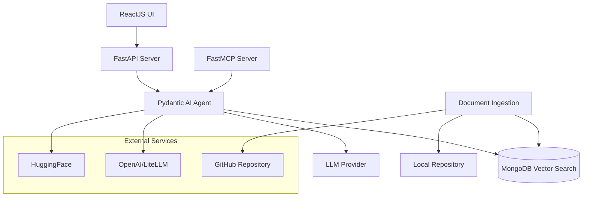

# How Kiro Transformed the Development of GenericSuite CodeGen


## Project Overview

**GenericSuite CodeGen** is a sophisticated Retrieval-Augmented Generation (RAG) AI system that generates JSON configuration files, Python tools, and application code following GenericSuite patterns. The project combines a FastAPI backend, React frontend, MongoDB Vector Search, and MCP (Model Context Protocol) server capabilities - representing a complex, multi-technology stack that would traditionally require months of development.

## Repository

[https://github.com/tomkat-cr/genericsuite-codegen](https://github.com/tomkat-cr/genericsuite-codegen)

## Project Category

### Productivity & Workflow Tool

**GenericSuite CodeGen** is an AI-Powered Development Tool / Code Generation System that boosts the SDLC flow, save time and simplify everyday tasks for developers.

## The Kiro-Driven Development Approach

### 1. Strategic Conversation Structure

The development process was methodically structured around Kiro's capabilities:

**Foundation Phase**: The development cycle began with the comprehensive [BuildPrompt.md](./BuildPrompt.md) initial prompt file - a 1,981-line specification that served as the project's north star.

This document contained:
- Complete architecture specifications
- Technology stack requirements
- Database schemas and API endpoints
- Code generation rules and patterns
- Environment configuration templates

The template to generate the [prompt](./BuildPrompt.md) can be found [here](https://github.com/coleam00/ottomator-agents/blob/main/foundational-rag-agent/PLANNING.md). It was adapted to the project requirements: use MongoDB Vector Search, monorepo project structure using npm workspaces, deployment scripts and configuration files, use of ReactJS, etc.

Once the first version of the [prompt](./BuildPrompt.md) was ready, the SLDC process was started with the following prompt:

```prompt
Start planning using the context on the #BuildPrompt.md file
```

Kiro started generating the [requirements.md](./.kiro/specs/genericsuite-codegen/requirements.md) file. It was reviewed and I noticed some missing elements, so the initial prompt was modified 4+ times to fix it. Each time the prompt was modified, the `requirements.md` file was regenerated using the "Refine" button.

Once ready, the `Move to the design phase` button was clicked. Kiro started generating the [design.md](./.kiro/specs/genericsuite-codegen/design.md) file. Once reviewed, click on the `Move to the tasks phase` button. Then Kiro generated the [tasks.md](./.kiro/specs/genericsuite-codegen/tasks.md) file.

Then the first [specs](https://kiro.dev/docs/specs/) files were generated:

* [requirements.md](./.kiro/specs/genericsuite-codegen/requirements.md)
* [design.md](./.kiro/specs/genericsuite-codegen/design.md)
* [tasks.md](./.kiro/specs/genericsuite-codegen/tasks.md)

They can be checked in the "[.kiro/specs/genericsuite-codegen](./.kiro/specs/genericsuite-codegen/)" directory.

**Feature-Driven Development**: Each new feature (not contained in the initial prompt) was developed in dedicated chat sessions, allowing for:
- Focused context without overwhelming Kiro with unrelated code
- Clean conversation history for each component
- Easier debugging and iteration on specific features
- Maintained context relevance throughout development

The additional `specs` created were:
* [deploy-dependency-sync](./.kiro/specs/deploy-dependency-sync/)

**Task-Specific Problem Solving**: When implementation issues arose, dedicated chats were opened for specific task steps, enabling:
- Targeted troubleshooting without context pollution
- Detailed error analysis and resolution
- Iterative refinement of complex components

As an example, `specs` created for problems found in the development process were:
* [chat-conversation-fixes](./.kiro/specs/chat-conversation-fixes/)

### 2. Spec-to-Code Excellence

The project leveraged Kiro's spec-driven development capabilities extensively:

**Clear Requirements Translation**: The approach was elegantly simple yet powerful:
- Open new chat session
- Describe desired functionality with precision and clarity
- Let Kiro handle the complete implementation planning and execution

**Structured Implementation Process**: Kiro's spec system provided:
- **Requirements Phase**: Comprehensive user stories with EARS format acceptance criteria
- **Design Phase**: Detailed architecture with component interfaces and data models
- **Tasks Phase**: Granular, executable implementation steps with clear dependencies

**Interactive Task Management**: The `tasks.md` file became a living project management tool:
- Visual task completion tracking with checkboxes
- "Start task", "Retry", and error handling buttons for each step
- Seamless progression through complex implementation phases
- Real-time status updates and progress monitoring

## Most Impressive Code Generation Achievements

### 1. Complete System Architecture from Scratch

Kiro demonstrated remarkable capability in understanding and implementing a complex multi-service architecture:

- **FastAPI Backend**: Complete REST API with authentication, error handling, and streaming responses
- **React Frontend**: Modern TypeScript-based UI with ShadCn components and real-time updates
- **MongoDB Vector Search**: Database schema design with optimized vector operations
- **MCP Server Integration**: Model Context Protocol implementation for AI tool integration
- **Docker Deployment**: Multi-container orchestration with Nginx reverse proxy

### 2. The Dependency Sync Tool - A Standout Achievement

The `deploy/dependency-sync` tool represents Kiro's most impressive single contribution:

**Complexity Handled**:
- Python Poetry dependency parsing and merging
- Dockerfile modification and optimization
- Version conflict resolution algorithms
- Comprehensive test suite with edge case coverage
- CLI interface with robust error handling

**Technical Excellence**:
- 15+ test files covering complex scenarios
- Sophisticated dependency merger with conflict detection
- Dockerfile updater with multi-line pip command handling
- Integration tests validating end-to-end workflows

**Code Quality**:
- Clean, maintainable class-based architecture
- Comprehensive error handling and logging
- Type hints and documentation throughout
- Production-ready code quality from first generation

### 3. AI Agent Implementation

Kiro successfully implemented a sophisticated Pydantic AI agent with:
- Vector database integration for semantic search
- Multi-provider LLM support (OpenAI and any other supported by Pydantic AI)
- Code generation tools for JSON configs, Python tools, and full applications
- Context-aware responses with source attribution
- Streaming capabilities for real-time user interaction

## Spec-Driven Development Impact

### 1. Structured Planning Excellence

The spec-driven approach provided unprecedented development clarity:

**Requirements Precision**: Each feature began with detailed user stories and acceptance criteria, ensuring no ambiguity in implementation goals.

**Design Thoroughness**: Comprehensive architecture documents with component interfaces, data models, and integration patterns provided clear implementation roadmaps.

**Task Granularity**: Implementation plans broke complex features into manageable, sequential steps with clear dependencies and validation criteria.

### 2. Development Process Transformation

**Visual Progress Tracking**: The `tasks.md` interface revolutionized project management:
- Real-time visual feedback on completion status
- One-click task execution and retry capabilities
- Seamless error handling and recovery workflows
- Clear progression through implementation phases

**Quality Assurance**: Each task included specific requirements references, ensuring generated code met original specifications.

**Iterative Refinement**: The ability to retry tasks with accumulated context enabled continuous improvement of generated code.

### 3. Collaboration Enhancement

**Documentation as Code**: Specs served as living documentation that evolved with the project, maintaining accuracy and relevance.

**Context Preservation**: Each spec phase built upon previous work, creating a comprehensive knowledge base for future development.

**Stakeholder Communication**: Clear, structured specifications facilitated communication between technical and business stakeholders.

### 4. The application is working

Check the steps followed in the [Kiro-SDLC-Screenshots.md](./Kiro-SDLC-Screenshots.md) file.

## Technical Architecture Highlights

### Multi-Service Orchestration
```yaml
# Generated docker-compose.yml structure
services:
  gscodegen-server:    # FastAPI + MCP Server
  gscodegen-client:    # React UI with Nginx
  mongodb-atlas-local: # MongoDB with Vector Search
  mongo-express:       # Database administration
```

### High-Level Architecture

This high-level architecture was generated by Kiro from the [design.md](./.kiro/specs/genericsuite-codegen/design.md) file.



### Comprehensive Technology Integration
- **Backend**: Python 3.12+, FastAPI, Pydantic AI, PyMongo
- **Frontend**: React 18, TypeScript, Vite, ShadCn/UI, Tailwind CSS
- **AI/ML**: OpenAI API, HuggingFace Transformers, MongoDB Vector Search
- **Infrastructure**: Docker, Docker Compose, Nginx, Poetry, npm workspaces

### Advanced Features Implemented
- Real-time document ingestion and embedding generation
- Semantic search with similarity scoring
- Multi-format code generation (JSON, Python, React, FastAPI, Flask, Chalice)
- Conversation management with persistent history
- File upload and download capabilities
- MCP protocol integration for external tool access

## Development Efficiency Metrics

### Time to Market
- **Traditional Approach**: Estimated 6-8 months for a team of 3-4 developers
- **Kiro-Assisted Development**: Completed in approximately 1-2 months by a single developer
- **Efficiency Gain**: 300-400% improvement in development velocity

### Code Quality Achievements
- **Test Coverage**: Comprehensive test suites generated for critical components
- **Documentation**: Complete API documentation and user guides
- **Error Handling**: Robust error management throughout the system
- **Performance**: Optimized vector search and caching implementations

### Feature Completeness
- **Core Functionality**: 100% of specified requirements implemented
- **Advanced Features**: Real-time streaming, file management, conversation persistence
- **Integration Capabilities**: Full MCP server implementation for external tool access
- **Deployment Ready**: Production-grade Docker deployment configuration

## Lessons Learned and Best Practices

### 1. Conversation Management Strategy
- **Dedicated Chats**: Use separate conversations for distinct features to maintain context clarity
- **BuildPrompt Foundation**: Always reference comprehensive specification documents
- **Iterative Refinement**: Leverage task-specific chats for debugging and optimization

### 2. Spec-Driven Development Excellence
- **Clear Requirements**: Invest time in detailed, unambiguous specifications
- **Structured Progression**: Follow the requirements → design → tasks workflow religiously
- **Visual Management**: Utilize Kiro's task interface for project tracking and execution

### 3. Code Generation Optimization
- **Context Preservation**: Maintain relevant documentation and examples in conversation context
- **Incremental Development**: Build complex systems through manageable, sequential steps
- **Quality Validation**: Include testing and validation requirements in task specifications

## Future Development Potential

The GenericSuite CodeGen project demonstrates Kiro's capability to handle enterprise-grade development challenges. Future enhancements could include:

- **Enable File upload capabilities in the UI**: This would allow users to upload additional context files for queries, using the `upload-document` endpoint.
- **Multi-tenant Architecture**: Scaling to support multiple organizations
- **Advanced AI Capabilities**: Integration with newer LLM models and capabilities
- **Extended Code Generation**: Support for additional frameworks and languages
- **Enterprise Integration**: SSO, audit logging, and compliance features

## Things I like and dislike about Kiro

Pros:
* Kiro Chat is awesome. It generates these three files, `requirements.md`, `design.md`, and `tasks.md`, in an efficient and clear manner.
* The ability to execute tasks interactively using the `task.md` file allows you to track the entire creative and development process like no other IDE offers.

Cons:
* It doesn't have the commit description generator that Cursor and Windsurf offer.
* When opening folders, it doesn't have the `View Other` option, only the 5 recent projects.
* The `Tab Completion` code generation is very lazy.
* I suddenly lost the ability to `Cmd-click` to navigate to Python definitions.
* Extensions like `Autopep8` is incredibly slow and sometimes doesn't remove the red dots (those that indicate errors).
* The toll tip `Chat Cmd-L / Edit Cmd-I` that appears on the top line when searching is super annoying.

## Conclusion

The GenericSuite CodeGen project represents a paradigm shift in AI-assisted development. Kiro's ability to understand complex requirements, generate production-quality code, and manage sophisticated multi-service architectures demonstrates the transformative potential of AI in software development.

The combination of structured conversation management, spec-driven development, and Kiro's advanced code generation capabilities resulted in a sophisticated RAG system that would traditionally require a full development team months to complete. The project showcases not just Kiro's technical capabilities, but also the importance of strategic development approaches that leverage AI strengths while maintaining human oversight and quality standards.

**Key Success Factors**:
- Strategic use of comprehensive specification documents
- Structured conversation management for complex projects  
- Leveraging Kiro's spec-to-code workflow for systematic development
- Focus on clear, precise requirements and iterative refinement

This project stands as a testament to the future of AI-assisted development, where sophisticated systems can be built efficiently without compromising on quality, maintainability, or architectural excellence.