# GenericSuite CodeGen

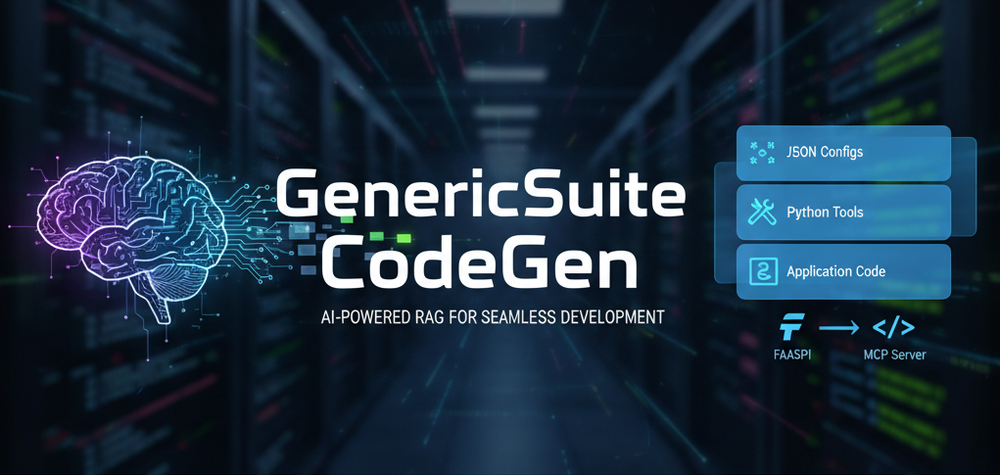

[](https://github.com/tomkat-cr/genericsuite-codegen)
[](https://www.python.org/downloads/)
[](https://nodejs.org/)
[](LICENSE)

GenericSuite CodeGen is an AI-powered RAG (Retrieval-Augmented Generation) system that generates JSON configuration files, Python tools, and application code following GenericSuite patterns. It combines a FastAPI backend with a React frontend and includes MCP (Model Context Protocol) server capabilities for seamless integration with AI development workflows.

## Kiro-Driven Development Approach

* How we used Kiro to develop the project: [Kiro-Usage.md](./Kiro-Usage.md)
* Kiro step-by-step process to develop the project: [Kiro-SDLC-Screenshots.md](./Kiro-SDLC-Screenshots.md).

## Table of Contents

- [Description](#description)
- [Features](#features)
- [Technologies](#technologies)
- [Getting Started](#getting-started)
  - [Prerequisites](#prerequisites)
  - [Installation](#installation)
- [Usage](#usage)
  - [Development Commands](#development-commands)
  - [Production Deployment](#production-deployment)
  - [MCP Server](#mcp-server)
- [Screenshots](#screenshots)
- [System Architecture](#system-architecture)
- [Project Structure](#project-structure)
- [License](#license)
- [Contributing](#contributing)
- [Credits](#credits)

## Description

GenericSuite CodeGen leverages AI and knowledge base search to assist developers in creating GenericSuite-compatible code and configurations. The system includes:

- **AI Agent**: Powered by Pydantic AI with support for OpenAI provider (and any other supported by Pydantic AI)
- **Knowledge Base**: Vector search using MongoDB and sentence transformers
- **Code Generation**: Automated generation of JSON configs, Python tools, and application code
- **MCP Integration**: Model Context Protocol server for AI development tools
- **Web Interface**: React-based UI for interactive code generation

## Features

- 🤖 **AI-Powered Code Generation**: Generate JSON configurations, Python tools, and application code
- 🔍 **Intelligent Knowledge Base**: Vector search through GenericSuite documentation and examples
- 🛠️ **Multiple Code Types**: Support for JSON configs, LangChain tools, MCP tools, frontend, and backend code
- 🎯 **Context-Aware Generation**: Automatic search for relevant examples based on code generation type
- 🌐 **Web Interface**: User-friendly React frontend with real-time code preview
- 📡 **MCP Server**: Integration with AI development environments via Model Context Protocol
- 🐳 **Docker Support**: Complete containerized deployment with MongoDB
- 🔄 **Real-time Streaming**: Streaming responses for better user experience
- 📚 **Document Processing**: Automated ingestion and processing of documentation
- 🔍 **Document Retrieval Tool**: Secure agent tool for accessing complete GenericSuite documents with path validation and error handling
- 🎯 **Enhanced Search Types**: Comprehensive type definitions for dual search operations, context-aware generation, and document retrieval workflows
- 🛡️ **Security Features**: Path validation, binary file detection, and secure document access controls

## Technologies

### Backend
- **FastAPI**: Modern Python web framework
- **Pydantic AI**: AI agent framework with tool integration
- **MongoDB**: Document database with vector search capabilities
- **Sentence Transformers**: Text embeddings for semantic search
- **OpenAI**: LLM provider support

### Frontend
- **React 18**: Modern React with TypeScript
- **Vite**: Fast build tool and development server
- **Tailwind CSS**: Utility-first CSS framework
- **Shadcn/ui**: Modern UI component library
- **Lucide React**: Beautiful icon library

### MCP Server
- **FastMCP**: MCP server implementation for tool integration

### Infrastructure
- **Docker**: Containerization and deployment
- **Poetry**: Python dependency management
- **npm**: Node.js package management
- **Nginx**: Reverse proxy and static file serving

## Getting Started

### Prerequisites

- **Python**: 3.12 or higher
- **Node.js**: 18.0 or higher
- **npm**: 8.0 or higher
- **Docker**: For containerized deployment
- **OpenAI API Key**: For AI functionality

### Installation

1. **Clone the repository**:
```bash
git clone https://github.com/tomkat-cr/genericsuite-codegen.git
cd genericsuite-codegen
```

2. **Initialize the environment**:
```bash
make init-app-environment
```

> This will copy the [.env.example](./.env.example) file to the `.env` file, and other example files to final/modficable files.

3. **Configure environment variables**:
   Edit the `.env` file with your API keys and configuration:
```bash
# Required: OpenAI API Key
OPENAI_API_KEY=your_openai_api_key_here

# Optional: Customize other settings
HF_TOKEN=your_huggingface_token_here
```

4. **Install dependencies**:
```bash
make install
```

## Usage

### Development Commands

**Start development environment**:
```bash
make dev
```
This starts all services in development mode with hot reloading.

**Start working with the application**:

- Open the browser and go to [http://localhost:3000](http://localhost:3000)

- You should see the dashboard.

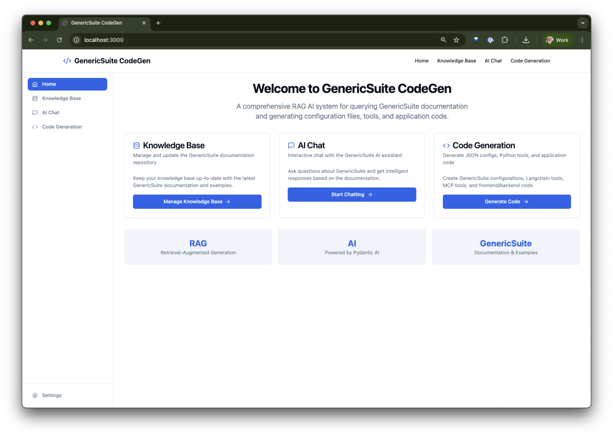

**Start individual services**:
```bash
# Start the local MongoDB container
make run-db-only

# Backend only
cd server && make run

# Frontend only  
cd ui && make run

# MCP server only
cd mcp-server && make run
```

**Run tests**:
```bash
# Backend tests
cd server && make test

# MCP server tests
cd mcp-server && make test
```

**Code formatting and linting**:
```bash
# Backend
cd server && make format && make lint

# Frontend
cd ui && make format && make lint

# MCP server
cd mcp-server && make format && make lint
```

### Production Deployment

**Start production services**:
```bash
make run
```

**View service status**:
```bash
make status
```

**View logs**:
```bash
# All services
make logs-f

# Server logs only
make server-logs
```

**Stop services**:
```bash
make down
```

**Clean up (removes volumes)**:
```bash
make clean-docker
```

**Restart services**:
```bash
make restart
```

**Hard restart services**:
```bash
make hard-restart
# (down and up everything, useful when `.env` file is modified)
```

### MCP Server

The MCP server provides integration with AI development tools through the Model Context Protocol:

**Start MCP server**:
```bash
cd mcp-server && make start
```

**Check MCP server configuration**:
```bash
cd mcp-server && make check-env
```

**MCP server endpoints**:
- HTTP: `http://localhost:8070`
- STDIO: Available for direct process communication
- WebSocket: Available for real-time communication

**Configure MCP Client Integration**:

For Kiro integration, add to your `.kiro/settings/mcp.json`:
```json
{
  "mcpServers": {
    "genericsuite-codegen": {
      "command": "sh",
      "args": ["/absolute/path/to/genericsuite-codegen/mcp-server/run_mcp_server.sh"],
      "env": {
        "MCP_API_KEY": "ag-api-key-...",
        "MCP_TRANSPORT": "stdio"
      },
      "disabled": false,
      "autoApprove": [
        "search_knowledge_base",
        "get_knowledge_base_stats"
      ]
    }
  }
}
```

For other MCP clients, see the configuration examples in the `mcp-server/` directory.

**New to MCP setup?** See the [MCP Setup Guide](./mcp-server/MCP_SETUP_GUIDE.md) for step-by-step configuration instructions.

## Screenshots

### Main Page / Dashboard


### Knowledge Base Page

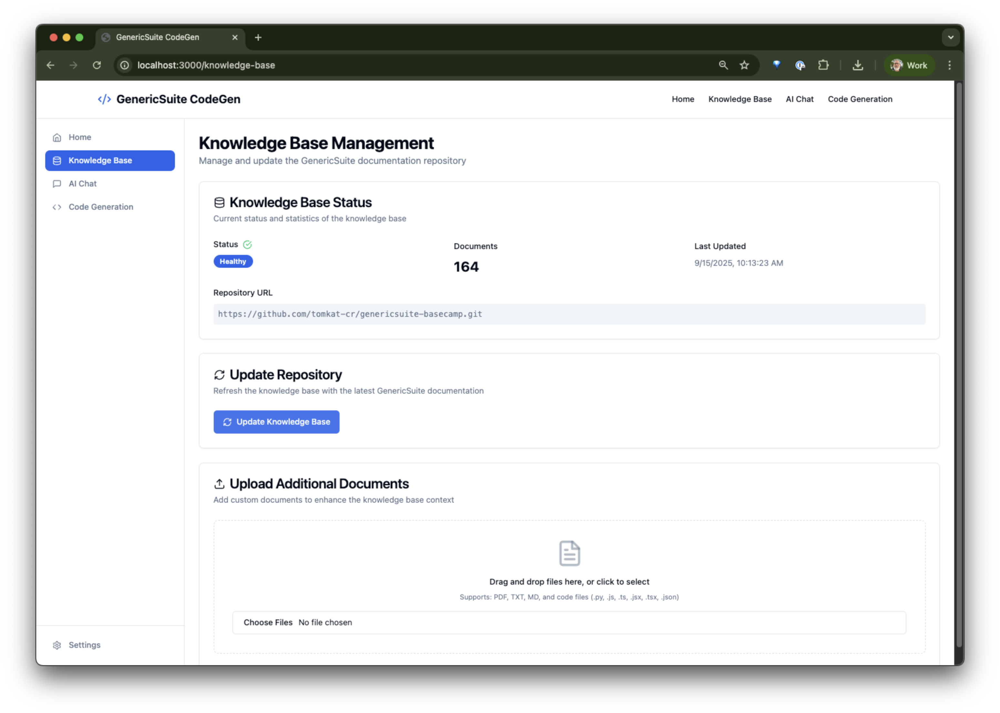

### AI Chat Page

- Click on the "AI Chat" button.

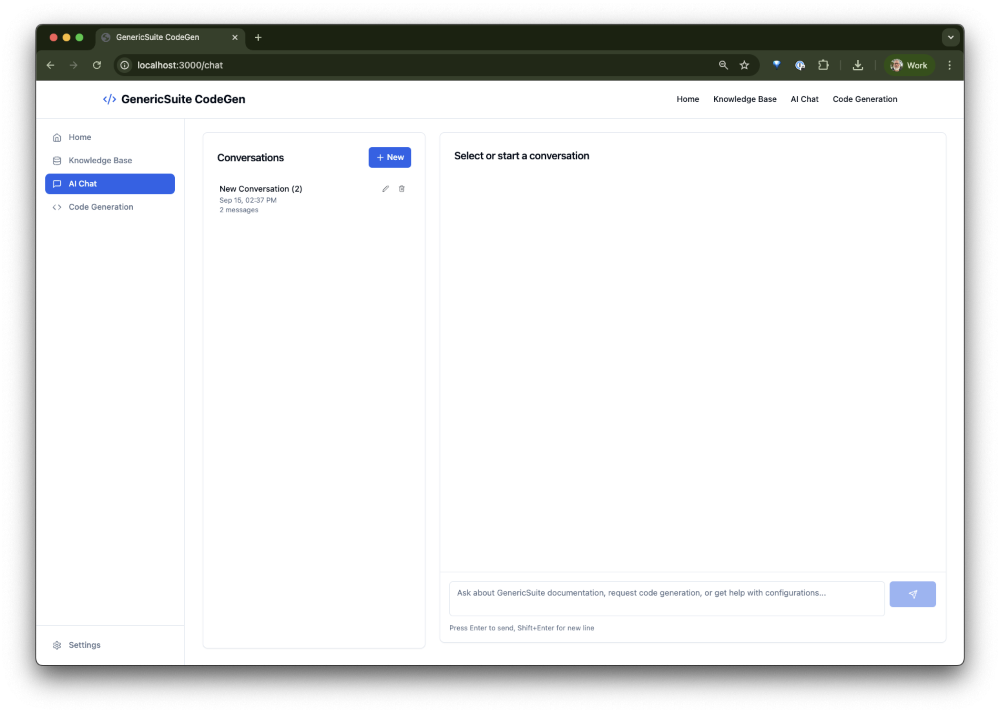

- Ask a question to the AI assistant using the bottom text area.

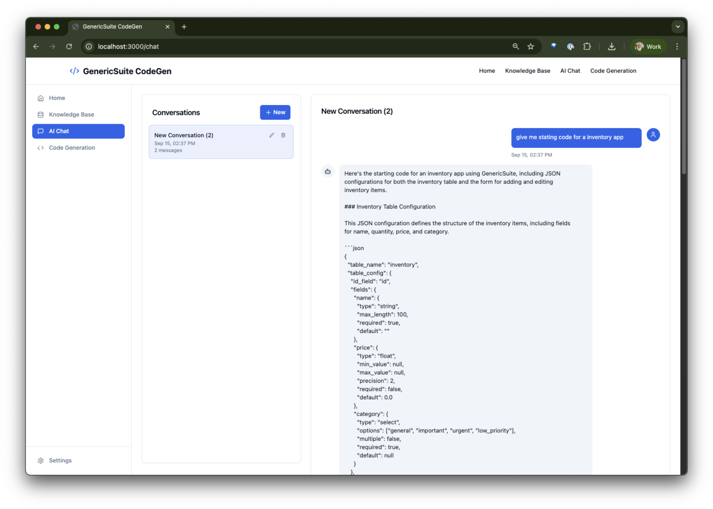

### Code Generation Page

- Click on the "Code Generation" button.

- For the "JSON Config" tab, fill the "Table Title" and "Table Requirements" input and text area.

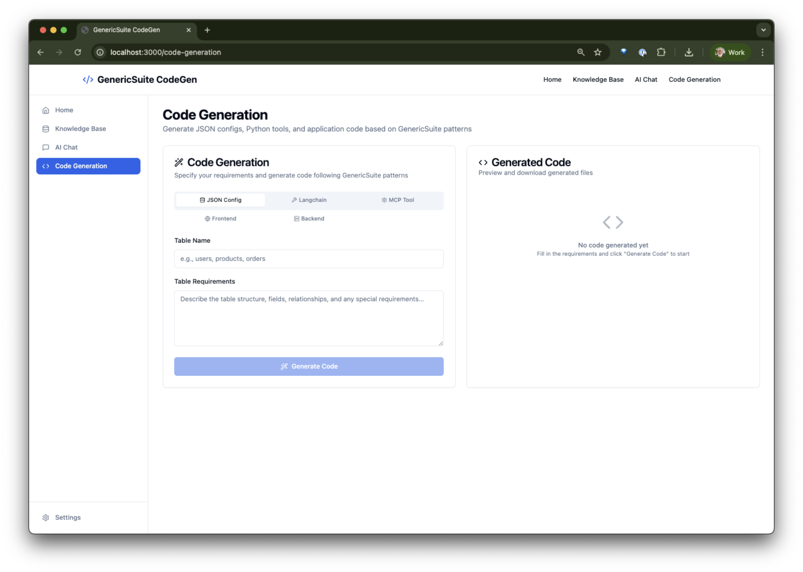

- For the "Langchain Tool" tab, fill the "Tool Name", "Tool Description",` and "Tool Requirements" input and text area.

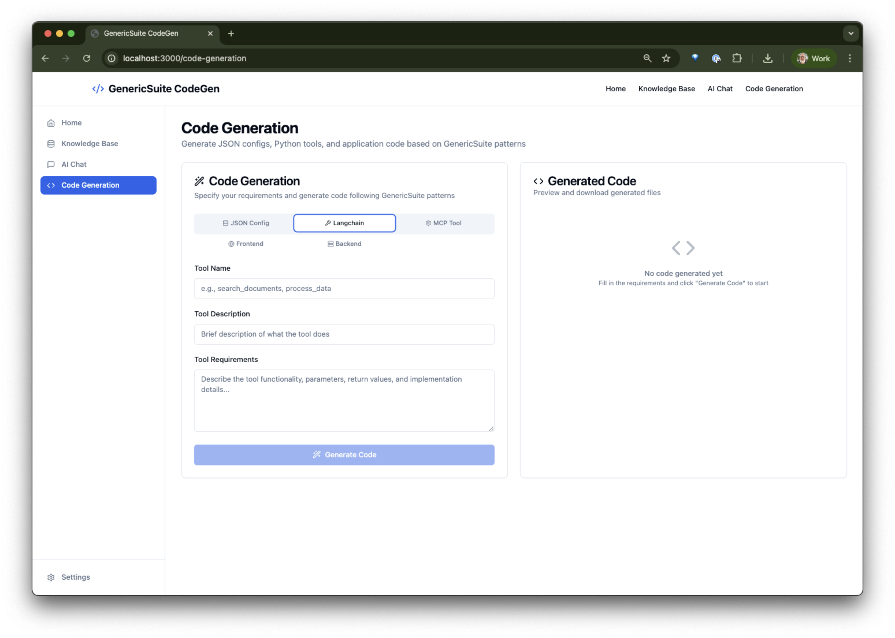

- For the "MCP Tool" tab, fill the "Tool Name", "Tool Description", and "Tool Requirements" input and text area.

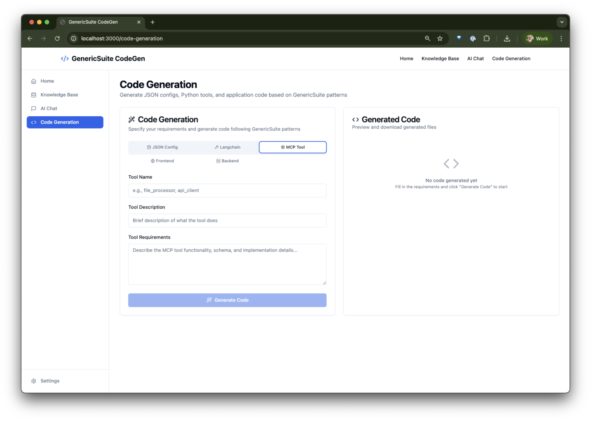

- For the "Frontend" tab, fill the "Frontend Requirements" input and text area.

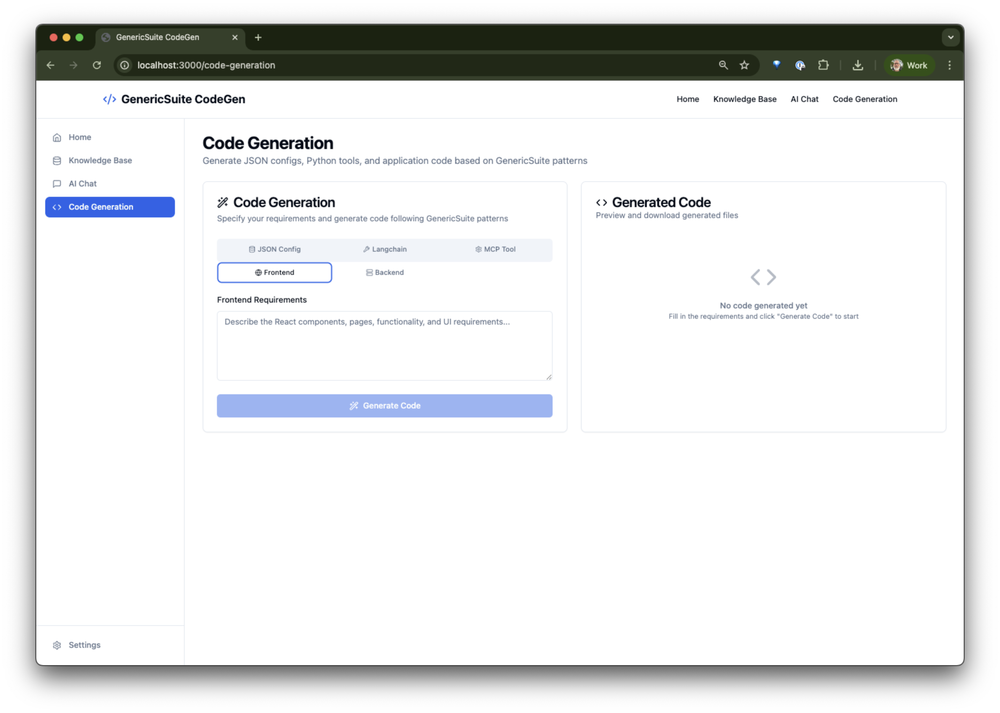

- For the "Backend" tab, select the "Backend Framework" and fill the "Backend Requirements" input and text area.

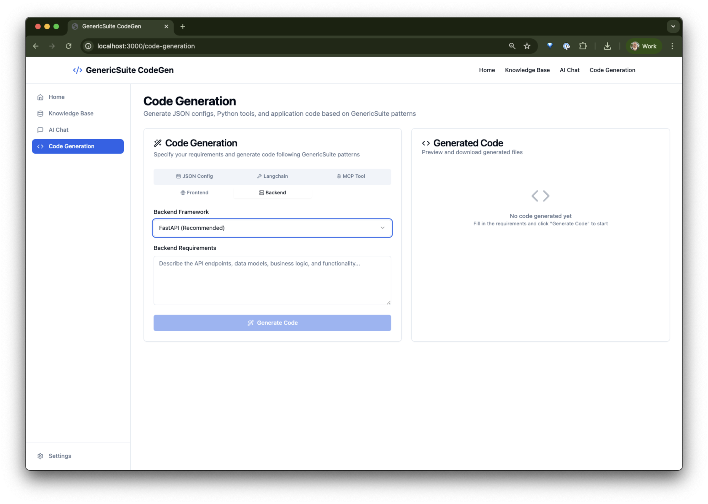

- Click on the "Generate Code" button.

- You should see the generated code in the preview area.

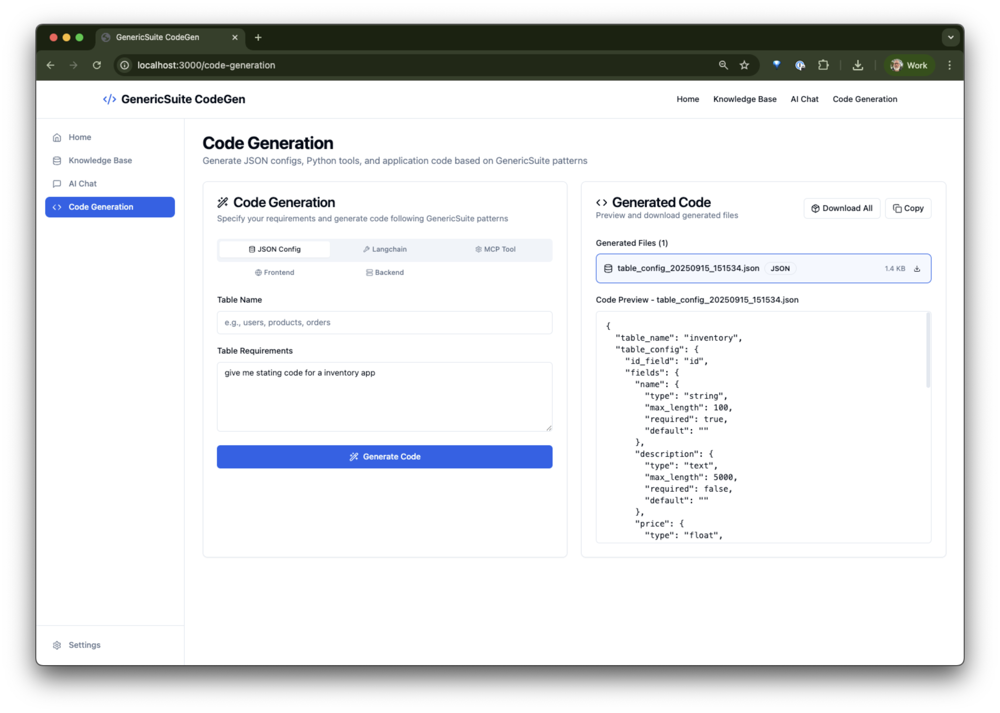
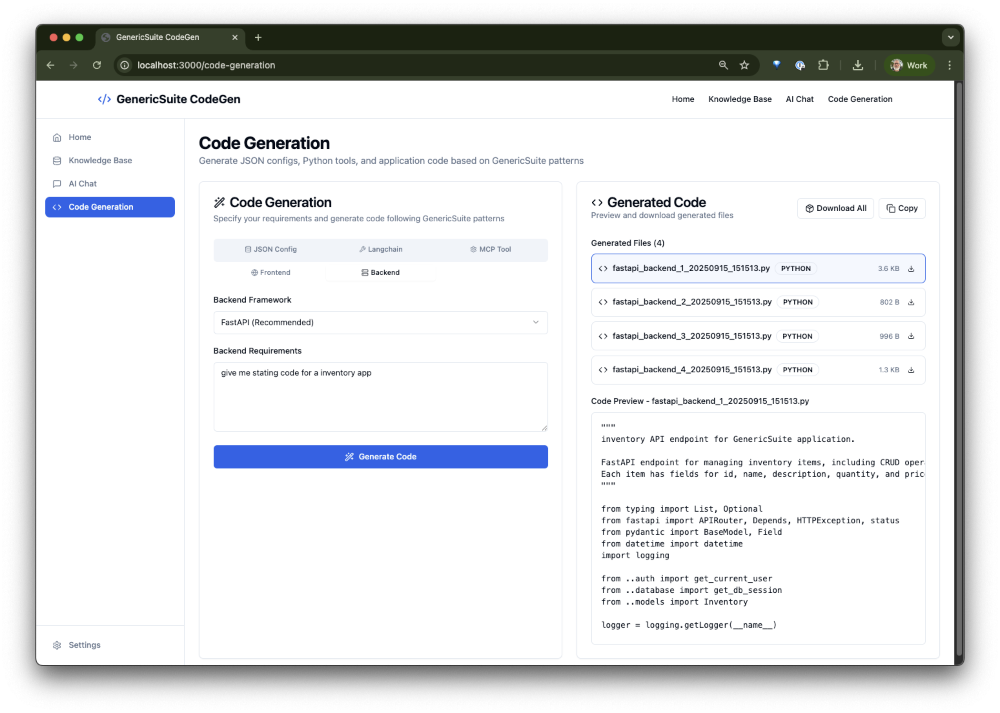

## Enhanced Search Documentation

Comprehensive documentation for the enhanced vector search capabilities is available:

- **[Enhanced Search Overview](server/docs/README.md)**: Complete documentation index and overview
- **[API Documentation](server/docs/API_DOCUMENTATION.md)**: Detailed API reference with enhanced search capabilities
- **[Enhanced Search Examples](server/docs/ENHANCED_SEARCH_EXAMPLES.md)**: Practical examples of dual search results and document retrieval
- **[Configuration Guide](server/docs/CONFIGURATION_GUIDE.md)**: Configuration options and template customization
- **[Troubleshooting Guide](server/docs/TROUBLESHOOTING_GUIDE.md)**: Diagnostic procedures and issue resolution

## Implementation Status

### ✅ Completed Features

**Enhanced Search Type Definitions**: Comprehensive data models and API types for dual search operations
- Location: `server/genericsuite_codegen/agent/enhanced_search_types.py`
- Includes: `CodeGenerationContext`, `DualSearchResult`, `DocumentContent`, `DocumentMetadata`, `SearchTemplate`, `EnhancedSearchConfig`
- Exception hierarchy with specific error codes for different failure scenarios

**Document Retrieval Tool**: Secure agent tool for accessing complete documents from local storage
- Location: `server/genericsuite_codegen/agent/document_retrieval_tool.py`
- Features: Path validation, binary file detection, encoding detection, batch operations
- Security: Prevents directory traversal attacks, validates file access permissions
- Integration: Available as Pydantic AI tools in the agent workflow

**Agent Tool Integration**: Document retrieval tools integrated with the AI agent
- Location: `server/genericsuite_codegen/agent/tools.py`
- Tools: `retrieve_document_from_local_storage`, `retrieve_multiple_documents_from_local_storage`
- Error handling: Comprehensive error responses with specific error codes

**Search Template Manager**: Configurable templates for different code generation types
- Location: `server/genericsuite_codegen/agent/search_templates.py`
- Configuration: `server/genericsuite_codegen/config/search_templates.json`
- Features: File-based configuration, hardcoded fallbacks, template validation, dynamic reloading
- Templates: JSON, LangChain, MCP, frontend, backend, AI-enhanced variants

**Context Determination Service**: Automatic context detection from user queries
- Location: `server/genericsuite_codegen/agent/context_determination.py`
- Features: Keyword-based detection, pattern matching, confidence scoring
- Integration: Automatic contextual search selection based on detected code type

**Enhanced Vector Search Engine**: Dual search combining user queries with contextual rules
- Location: `server/genericsuite_codegen/agent/enhanced_search.py`
- Features: Parallel dual search, result merging, fallback handling
- Integration: Seamless integration with existing knowledge base tool

**Comprehensive Testing**: Unit and integration tests for enhanced search components
- Location: `server/tests/`
- Coverage: All enhanced search components, error handling, integration scenarios
- Types: Unit tests, integration tests, end-to-end workflow tests

**Complete Documentation**: Comprehensive documentation with examples and troubleshooting
- Location: `server/docs/`
- Includes: API reference, configuration guide, examples, troubleshooting procedures
- Coverage: All enhanced search features, integration patterns, common issues

## System Architecture

The following diagram illustrates the system architecture and component relationships:

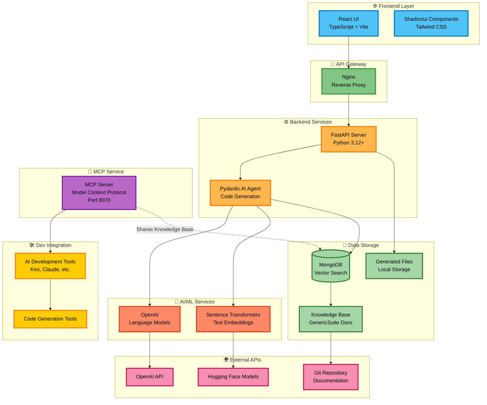
```mermaid
graph TB
    subgraph Frontend["🌐 Frontend Layer"]
        UI[React UI<br/>TypeScript + Vite]
        COMP[Shadcn/ui Components<br/>Tailwind CSS]
    end

    subgraph Gateway["🚪 API Gateway"]
        NGINX[Nginx<br/>Reverse Proxy]
    end

    subgraph Backend["⚙️ Backend Services"]
        API[FastAPI Server<br/>Python 3.12+]
        AGENT[Pydantic AI Agent<br/>Code Generation]
    end

    subgraph MCPService["📡 MCP Service"]
        MCP[MCP Server<br/>Model Context Protocol<br/>Port 8070]
    end

    subgraph AI["🤖 AI/ML Services"]
        LLM[OpenAI<br/>Language Models]
        EMBED[Sentence Transformers<br/>Text Embeddings]
    end

    subgraph Data["💾 Data Storage"]
        MONGO[(MongoDB<br/>Vector Search)]
        KB[Knowledge Base<br/>GenericSuite Docs]
        FILES[Generated Files<br/>Local Storage]
    end

    subgraph External["🌍 External APIs"]
        OPENAI[OpenAI API]
        HF[Hugging Face Models]
        GIT[Git Repository<br/>Documentation]
    end

    subgraph DevTools["🛠️ Dev Integration"]
        IDE[AI Development Tools<br/>Kiro, Claude, etc.]
        TOOLS[Code Generation Tools]
    end

    %% Main Web App Flow
    UI --> NGINX
    NGINX --> API
    API --> AGENT
    AGENT --> LLM
    AGENT --> EMBED
    AGENT --> MONGO
    
    %% Data Connections
    MONGO --> KB
    KB --> GIT
    API --> FILES
    
    %% External Connections
    LLM --> OPENAI
    EMBED --> HF
    
    %% Independent MCP Integration
    MCP --> IDE
    IDE --> TOOLS
    MCP -.->|Shares Knowledge Base| MONGO

    %% Styling with vivid, high-contrast colors
    classDef frontend fill:#4FC3F7,stroke:#0277BD,stroke-width:3px,color:#000
    classDef gateway fill:#81C784,stroke:#388E3C,stroke-width:3px,color:#000
    classDef backend fill:#FFB74D,stroke:#F57C00,stroke-width:3px,color:#000
    classDef mcp fill:#BA68C8,stroke:#7B1FA2,stroke-width:3px,color:#000
    classDef ai fill:#FF8A65,stroke:#D84315,stroke-width:3px,color:#000
    classDef data fill:#A5D6A7,stroke:#2E7D32,stroke-width:3px,color:#000
    classDef external fill:#F48FB1,stroke:#C2185B,stroke-width:3px,color:#000
    classDef dev fill:#FFCC02,stroke:#F57F17,stroke-width:3px,color:#000

    class UI,COMP frontend
    class NGINX gateway
    class API,AGENT backend
    class MCP mcp
    class LLM,EMBED ai
    class MONGO,KB,FILES data
    class OPENAI,HF,GIT external
    class IDE,TOOLS dev
```

### Component Descriptions

- **React UI**: Modern TypeScript-based frontend with Vite build system
- **FastAPI Server**: High-performance Python web framework handling API requests
- **Pydantic AI Agent**: Core AI agent for code generation and knowledge retrieval
- **MCP Server**: Model Context Protocol server for AI development tool integration
- **MongoDB**: Document database with vector search capabilities for knowledge base
- **Nginx**: Reverse proxy and static file server for production deployment
- **OpenAI**: Language model providers for AI-powered code generation
- **Sentence Transformers**: Text embedding models for semantic search

### Data Flow

1. **User Request**: User submits code generation request through React UI
2. **API Processing**: FastAPI server receives and validates the request
3. **Knowledge Retrieval**: AI agent searches MongoDB knowledge base using vector embeddings
4. **Code Generation**: Agent uses retrieved context with LLM to generate code
5. **Response Delivery**: Generated code is returned to user through streaming or standard response
6. **MCP Integration**: External AI tools can access the system through MCP protocol

## Project Structure

```
genericsuite-codegen/
├── server/                          # FastAPI backend
│   ├── genericsuite_codegen/
│   │   ├── agent/                   # AI agent implementation
│   │   ├── api/                     # FastAPI endpoints
│   │   ├── database/                # MongoDB setup and utilities
│   │   ├── document_processing/     # Document ingestion and processing
│   │   └── mcp_server/             # MCP server implementation
│   ├── pyproject.toml              # Python dependencies
│   └── Makefile                    # Server commands
├── ui/                             # React frontend
│   ├── src/
│   │   ├── components/             # Reusable UI components
│   │   ├── pages/                  # Application pages
│   │   └── lib/                    # Utilities and API client
│   ├── package.json                # Node.js dependencies
│   └── Makefile                    # Frontend commands
├── mcp-server/                     # MCP server standalone
│   ├── pyproject.toml              # MCP server dependencies
│   └── Makefile                    # MCP server commands
├── deploy/                         # Docker deployment
│   ├── docker-compose.yml          # Service orchestration
│   ├── docker_images/              # Custom Docker images
│   └── Makefile                    # Deployment commands
├── scripts/                        # Utility scripts
├── local_repo_files/              # Local knowledge base files
├── .env.example                   # Environment configuration template
├── package.json                   # Root workspace configuration
└── Makefile                       # Main project commands
```

## License

This project is licensed under the MIT License. See the [LICENSE](LICENSE) file for details.

## Contributing

1. Fork the repository
2. Create a feature branch (`git checkout -b feature/amazing-feature`)
3. Commit your changes (`git commit -m 'Add some amazing feature'`)
4. Push to the branch (`git push origin feature/amazing-feature`)
5. Open a Pull Request

Please ensure your code follows the project's coding standards:
- Run `make format` and `make lint` before committing
- Add tests for new functionality
- Update documentation as needed

## Credits

This project is developed and maintained by [Carlos J. Ramirez](https://github.com/tomkat-cr). For more information or to contribute to the project, visit [genericsuite-codegen](https://github.com/tomkat-cr/genericsuite-codegen).
