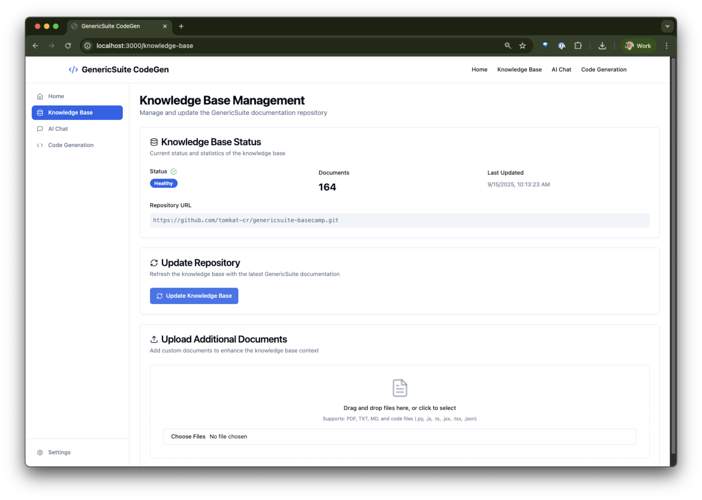
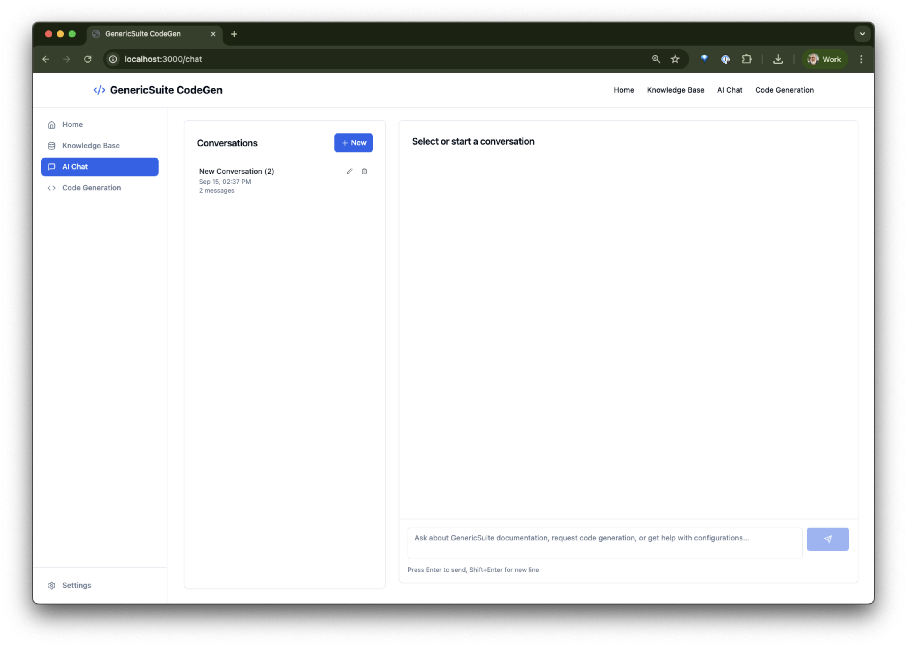
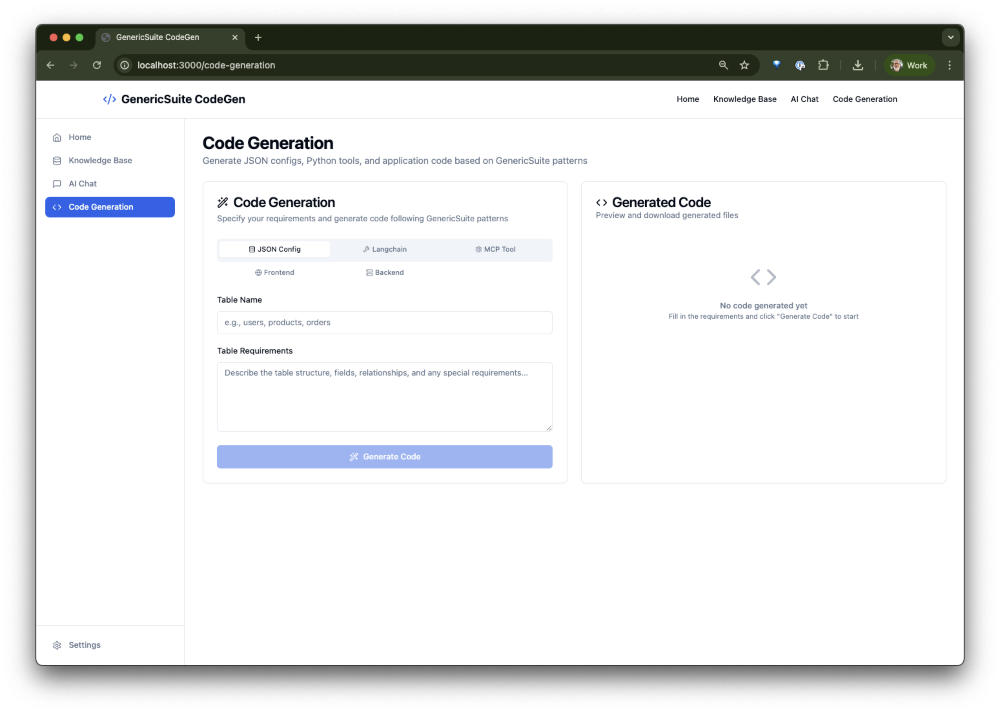
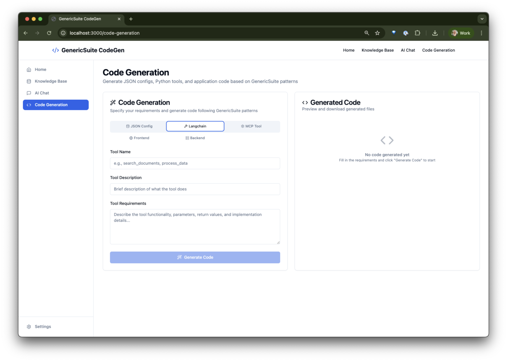
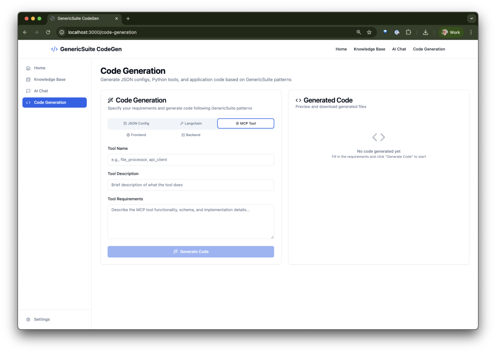
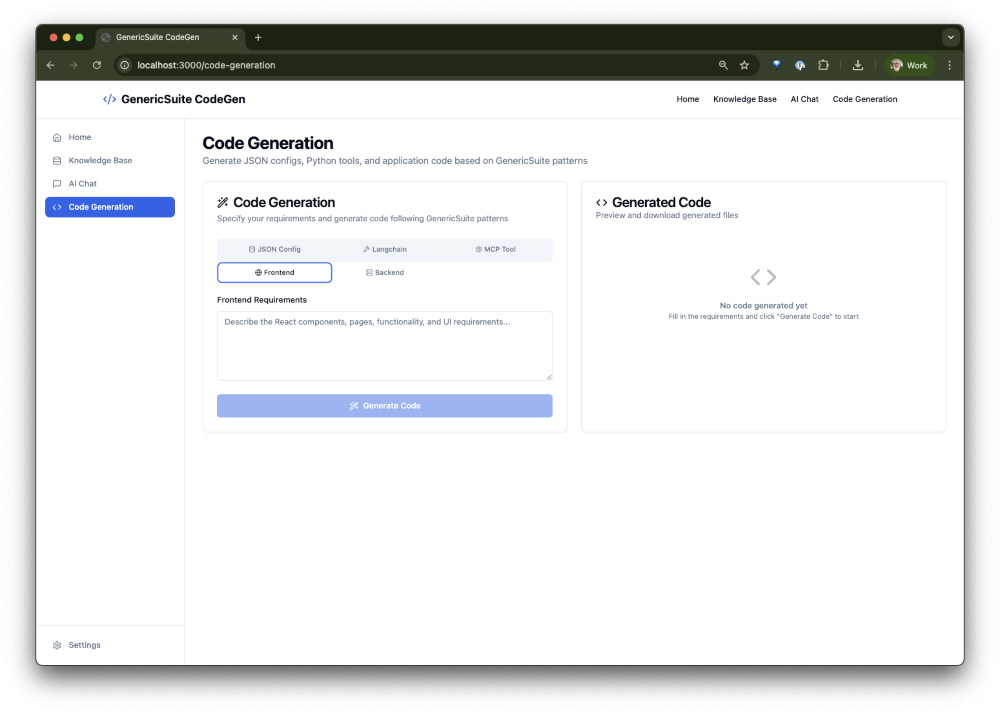
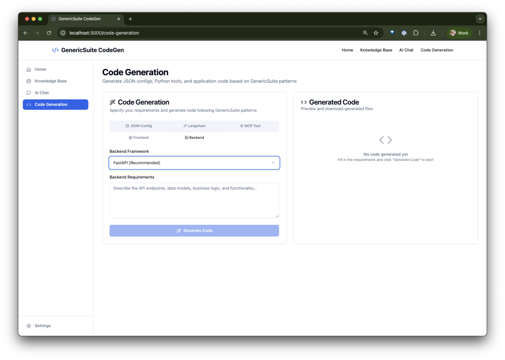
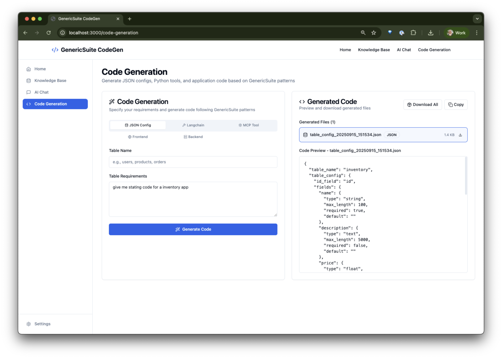
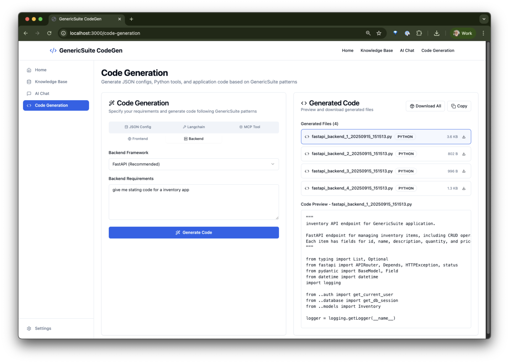

# GenericSuite CodeGen


[](https://github.com/tomkat-cr/genericsuite-codegen)
[](https://www.python.org/downloads/)
[](https://nodejs.org/)
[](LICENSE)

GenericSuite CodeGen is an AI-powered RAG (Retrieval-Augmented Generation) system that generates JSON configuration files, Python tools, and application code following GenericSuite patterns. It combines a FastAPI backend with a React frontend and includes MCP (Model Context Protocol) server capabilities for seamless integration with AI development workflows.

## Kiro-Driven Development Approach

* How we used Kiro to develop the project: [Kiro-Usage.md](./Kiro-Usage.md)
* Kiro step-by-step process to develop the project: [Kiro-SDLC-Screenshots.md](./Kiro-SDLC-Screenshots.md).

## Table of Contents

- [Description](#description)
- [Features](#features)
- [Technologies](#technologies)
- [Getting Started](#getting-started)
  - [Prerequisites](#prerequisites)
  - [Installation](#installation)
- [Usage](#usage)
  - [Development Commands](#development-commands)
  - [Production Deployment](#production-deployment)
  - [MCP Server](#mcp-server)
- [Screenshots](#screenshots)
- [System Architecture](#system-architecture)
- [Project Structure](#project-structure)
- [License](#license)
- [Contributing](#contributing)
- [Credits](#credits)

## Description

GenericSuite CodeGen leverages AI and knowledge base search to assist developers in creating GenericSuite-compatible code and configurations. The system includes:

- **AI Agent**: Powered by Pydantic AI with support for OpenAI provider (and any other supported by Pydantic AI)
- **Knowledge Base**: Vector search using MongoDB and sentence transformers
- **Code Generation**: Automated generation of JSON configs, Python tools, and application code
- **MCP Integration**: Model Context Protocol server for AI development tools
- **Web Interface**: React-based UI for interactive code generation

## Features

- 🤖 **AI-Powered Code Generation**: Generate JSON configurations, Python tools, and application code
- 🔍 **Intelligent Knowledge Base**: Vector search through GenericSuite documentation and examples
- 🛠️ **Multiple Code Types**: Support for JSON configs, LangChain tools, MCP tools, frontend, and backend code
- 🌐 **Web Interface**: User-friendly React frontend with real-time code preview
- 📡 **MCP Server**: Integration with AI development environments via Model Context Protocol
- 🐳 **Docker Support**: Complete containerized deployment with MongoDB
- 🔄 **Real-time Streaming**: Streaming responses for better user experience
- 📚 **Document Processing**: Automated ingestion and processing of documentation

## Technologies

### Backend
- **FastAPI**: Modern Python web framework
- **Pydantic AI**: AI agent framework with tool integration
- **MongoDB**: Document database with vector search capabilities
- **Sentence Transformers**: Text embeddings for semantic search
- **OpenAI**: LLM provider support

### Frontend
- **React 18**: Modern React with TypeScript
- **Vite**: Fast build tool and development server
- **Tailwind CSS**: Utility-first CSS framework
- **Shadcn/ui**: Modern UI component library
- **Lucide React**: Beautiful icon library

### MCP Server
- **FastMCP**: MCP server implementation for tool integration

### Infrastructure
- **Docker**: Containerization and deployment
- **Poetry**: Python dependency management
- **npm**: Node.js package management
- **Nginx**: Reverse proxy and static file serving

## Getting Started

### Prerequisites

- **Python**: 3.12 or higher
- **Node.js**: 18.0 or higher
- **npm**: 8.0 or higher
- **Docker**: For containerized deployment
- **OpenAI API Key**: For AI functionality

### Installation

1. **Clone the repository**:
```bash
git clone https://github.com/tomkat-cr/genericsuite-codegen.git
cd genericsuite-codegen
```

2. **Initialize the environment**:
```bash
make init-app-environment
```

> This will copy the [.env.example](./.env.example) file to the `.env` file, and other example files to final/modficable files.

3. **Configure environment variables**:
   Edit the `.env` file with your API keys and configuration:
```bash
# Required: OpenAI API Key
OPENAI_API_KEY=your_openai_api_key_here

# Optional: Customize other settings
HF_TOKEN=your_huggingface_token_here
```

4. **Install dependencies**:
```bash
make install
```

## Usage

### Development Commands

**Start development environment**:
```bash
make dev
```
This starts all services in development mode with hot reloading.

**Start working with the application**:

- Open the browser and go to [http://localhost:3000](http://localhost:3000)

- You should see the dashboard.


**Start individual services**:
```bash
# Start the local MongoDB container
make run-db-only

# Backend only
cd server && make run

# Frontend only  
cd ui && make run

# MCP server only
cd mcp-server && make run
```

**Run tests**:
```bash
# Backend tests
cd server && make test

# MCP server tests
cd mcp-server && make test
```

**Code formatting and linting**:
```bash
# Backend
cd server && make format && make lint

# Frontend
cd ui && make format && make lint

# MCP server
cd mcp-server && make format && make lint
```

### Production Deployment

**Start production services**:
```bash
make run
```

**View service status**:
```bash
make status
```

**View logs**:
```bash
# All services
make logs-f

# Server logs only
make server-logs
```

**Stop services**:
```bash
make down
```

**Clean up (removes volumes)**:
```bash
make clean-docker
```

**Restart services**:
```bash
make restart
```

**Hard restart services**:
```bash
make hard-restart
# (down and up everything, useful when `.env` file is modified)
```

### MCP Server

The MCP server provides integration with AI development tools:

**Start MCP server**:
```bash
cd mcp-server && make start
```

**Check MCP server configuration**:
```bash
cd mcp-server && make check-env
```

**MCP server endpoints**:
- HTTP: `http://localhost:8070`
- WebSocket: Available for real-time communication

## Screenshots

### Main Page

- Open the browser and go to [http://localhost:3000](http://localhost:3000)

- You should see the dashboard.


### Knowledge Base Page



### Conversation Page

- Click on the "AI Chat" button.



- Ask a question to the AI assistant using the bottom text area.


### Code Generation Page

- Click on the "Code Generation" button.

- For the "JSON Config" tab, fill the "Table Title" and "Table Requirements" input and text area.



- For the "Langchain Tool" tab, fill the "Tool Name", "Tool Description",` and "Tool Requirements" input and text area.



- For the "MCP Tool" tab, fill the "Tool Name", "Tool Description", and "Tool Requirements" input and text area.



- For the "Frontend" tab, fill the "Frontend Requirements" input and text area.



- For the "Backend" tab, select the "Backend Framework" and fill the "Backend Requirements" input and text area.



- Click on the "Generate Code" button.

- You should see the generated code in the preview area.




## System Architecture

The following diagram illustrates the system architecture and component relationships:


### Component Descriptions

- **React UI**: Modern TypeScript-based frontend with Vite build system
- **FastAPI Server**: High-performance Python web framework handling API requests
- **Pydantic AI Agent**: Core AI agent for code generation and knowledge retrieval
- **MCP Server**: Model Context Protocol server for AI development tool integration
- **MongoDB**: Document database with vector search capabilities for knowledge base
- **Nginx**: Reverse proxy and static file server for production deployment
- **OpenAI**: Language model providers for AI-powered code generation
- **Sentence Transformers**: Text embedding models for semantic search

### Data Flow

1. **User Request**: User submits code generation request through React UI
2. **API Processing**: FastAPI server receives and validates the request
3. **Knowledge Retrieval**: AI agent searches MongoDB knowledge base using vector embeddings
4. **Code Generation**: Agent uses retrieved context with LLM to generate code
5. **Response Delivery**: Generated code is returned to user through streaming or standard response
6. **MCP Integration**: External AI tools can access the system through MCP protocol

## Project Structure

```
genericsuite-codegen/
├── server/                          # FastAPI backend
│   ├── genericsuite_codegen/
│   │   ├── agent/                   # AI agent implementation
│   │   ├── api/                     # FastAPI endpoints
│   │   ├── database/                # MongoDB setup and utilities
│   │   ├── document_processing/     # Document ingestion and processing
│   │   └── mcp_server/             # MCP server implementation
│   ├── pyproject.toml              # Python dependencies
│   └── Makefile                    # Server commands
├── ui/                             # React frontend
│   ├── src/
│   │   ├── components/             # Reusable UI components
│   │   ├── pages/                  # Application pages
│   │   └── lib/                    # Utilities and API client
│   ├── package.json                # Node.js dependencies
│   └── Makefile                    # Frontend commands
├── mcp-server/                     # MCP server standalone
│   ├── pyproject.toml              # MCP server dependencies
│   └── Makefile                    # MCP server commands
├── deploy/                         # Docker deployment
│   ├── docker-compose.yml          # Service orchestration
│   ├── docker_images/              # Custom Docker images
│   └── Makefile                    # Deployment commands
├── scripts/                        # Utility scripts
├── local_repo_files/              # Local knowledge base files
├── .env.example                   # Environment configuration template
├── package.json                   # Root workspace configuration
└── Makefile                       # Main project commands
```

## License

This project is licensed under the MIT License. See the [LICENSE](LICENSE) file for details.

## Contributing

1. Fork the repository
2. Create a feature branch (`git checkout -b feature/amazing-feature`)
3. Commit your changes (`git commit -m 'Add some amazing feature'`)
4. Push to the branch (`git push origin feature/amazing-feature`)
5. Open a Pull Request

Please ensure your code follows the project's coding standards:
- Run `make format` and `make lint` before committing
- Add tests for new functionality
- Update documentation as needed

## Credits

This project is developed and maintained by [Carlos J. Ramirez](https://github.com/tomkat-cr). For more information or to contribute to the project, visit [genericsuite-codegen](https://github.com/tomkat-cr/genericsuite-codegen).
